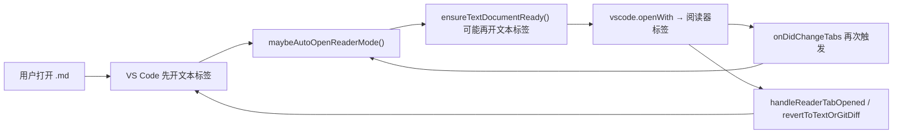

# 修复 Markdown 阅读器打开行为

## 问题根因

当前行为由 [`src/extension.ts`](src/extension.ts) 中两套逻辑叠加造成：



1. **页面疯狂跳动**：`setupAutoOpenReaderMode` 监听每次文本标签打开，400ms 后自动 `openInReaderMode`；同时 `handleReaderTabOpened` / `reconcileRestoredReaderTabs` 可能在 Git/Diff 场景下 `revertToTextOrGitDiff` 关阅读器、重开文本。两者形成标签页来回切换，表现为 Cursor 界面“乱跳”。
2. **多开一个标签页**：`openInReaderMode` 里的 `ensureTextDocumentReady` 在文件尚未以文本形式打开时，会调用 `showTextDocument` 先开一个 pinned 文本标签，再 `openWith` 开阅读器标签，截图里同一文件出现两个标签（如两个 `tomodachi-cite-demo.md`）即为此因。
3. **安装后默认用插件打开**：[`package.json`](package.json) 中 `meowReportMarkdown.autoOpenReaderMode` 默认值为 `true`，配合 `onDidChangeTabs` 自动转换逻辑，导致普通单击 `.md` 也会进入阅读器。
4. **右键菜单位置靠下**：[`package.json`](package.json) 的 `explorer/context` 未指定 `group`，扩展命令落在菜单末尾默认分组。

---

## 改动方案

### 1. 关闭默认自动打开（保留可选配置）

修改 [`package.json`](package.json)：

```json
"meowReportMarkdown.autoOpenReaderMode": {
  "default": false,
  ...
}
```

- 普通单击 `.md` 恢复 VS Code/Cursor 默认文本编辑器行为。
- 保留该配置项，供需要自动打开的用户手动开启。
- `setupAutoOpenReaderMode` / Git-Diff 抑制逻辑**保留**：用户通过右键手动打开时，仍需要避免 Git 变更文件误进阅读器。

同步更新 [`README.md`](README.md) 中 Usage / FAQ 段落，说明默认不再自动打开，推荐通过右键菜单使用。

### 2. 修复打开时的标签页问题（核心）

重构 [`src/extension.ts`](src/extension.ts) 中的 `openInReaderMode` 与 `ensureTextDocumentReady`：

**a) 优先复用已有阅读器标签**

- 若 `hasReaderModeTab(uri)` 为 true，直接 `vscode.openWith(uri, READER_VIEW_TYPE)` 聚焦，不再走完整开标签流程。

**b) 轻量加载文档，避免预开文本标签**

- 默认只做 `vscode.workspace.openTextDocument(uri)`（满足 CustomTextEditor 对 TextDocument 的后台要求）。
- **不再**默认调用 `showTextDocument`。
- 仅在 Cursor 断言失败（`Argument is undefined or null`）的重试路径上，才 fallback 到 `showTextDocument` + 延迟 + 重试 `openWith`（保留现有 Cursor 兼容性，见 README FAQ）。

**c) 打开后清理重复文本标签**

新增 `closeDuplicateTextTab(uri)`：
- 阅读器标签已存在时，关闭同一 URI 的 `TabInputText` 标签（保留 Diff / Git 相关标签不动）。
- 在 `openInReaderMode` 成功返回前调用，消除“文本 + 阅读器”双标签。

**d) 指定打开位置**

- 调用 `vscode.openWith` 时传入当前活动编辑器的 `viewColumn` 与 `{ pinned: true }`，使阅读器在当前编辑组、当前位置打开，而不是漂到标签栏末尾：

```typescript
const column = vscode.window.activeTextEditor?.viewColumn ?? vscode.ViewColumn.Active;
await vscode.commands.executeCommand(
  "vscode.openWith",
  uri,
  READER_VIEW_TYPE,
  [column, { pinned: true }]
);
```

**e) 防止并发重复打开**

- 对同一 URI 加简单的 in-flight 锁（Map），避免快速连点右键或 tab 事件并发触发多次 `openInReaderMode`。

### 3. 右键菜单提升到顶部区域

修改 [`package.json`](package.json) 的 `menus`：

```json
"explorer/context": [
  {
    "command": "meowReportMarkdown.openPreview",
    "when": "resourceExtname == .md",
    "group": "navigation@2"
  }
],
"editor/title/context": [
  {
    "command": "meowReportMarkdown.openPreview",
    "when": "resourceExtname == .md",
    "group": "navigation@2"
  }
]
```

- `navigation` 是 VS Code 资源管理器右键菜单的**最顶部分组**（与 “Open Preview” 等同区）。
- `@2` 使其排在 “Open Preview” 之后、其他导航项附近，避免落到菜单最底部。

可选：将命令标题缩短为 **“Meow Report 阅读器”** 或 **“用 Meow Report 打开”**，便于在 navigation 区辨认（非必须，可按你的偏好定）。

### 4. 验证方式

改完后用 F5 扩展开发宿主窗口验证：

| 场景 | 期望结果 |
|------|----------|
| 单击 `.md` 文件 | 以普通文本编辑器打开，不自动跳转阅读器 |
| 资源管理器右键 → Open with Meow Report | 只开 **1 个** 阅读器标签，不额外开文本标签 |
| 文本编辑器已打开某 `.md`，再右键用阅读器打开 | 当前标签替换/转为阅读器，不在末尾多开一个 |
| 同一文件连续右键打开两次 | 聚焦已有阅读器标签，不重复创建 |
| Git 变更中的 `.md` 预览打开 | 仍保持 Diff/文本行为，不强制进阅读器 |
| 右键菜单位置 | 出现在顶部 “Open Preview” 同一区域 |

---

## 涉及文件

- [`package.json`](package.json) — 配置默认值 + 菜单 group
- [`src/extension.ts`](src/extension.ts) — 打开逻辑重构（主要改动）
- [`README.md`](README.md) — 文档同步（默认行为说明）

不改动 webview 渲染逻辑（`reportViewer.js` / `report.css`），本次仅修扩展宿主层的打开与菜单行为。
