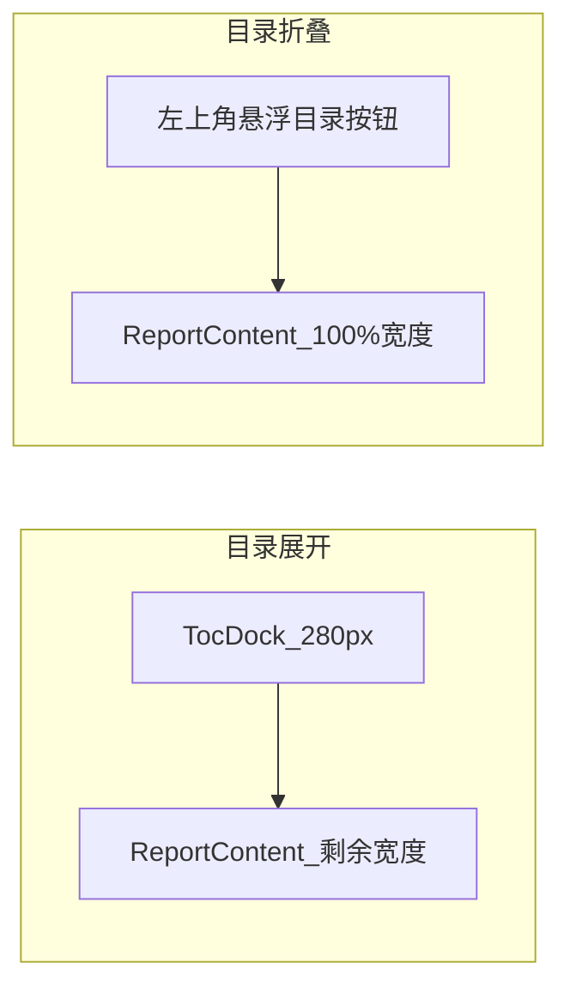

# 目录推开布局 + 最深层级滚动高亮

## 现状

- 目录在 [`media/report.css`](media/report.css) 中使用 `position: fixed` 悬浮，正文不会被挤开。
- HTML 顺序为 `article` 在前、`aside#tocDock` 在后（[`src/extension.ts`](src/extension.ts)）。
- CSS 已有 `.toc-active` 样式，但 [`media/reportViewer.js`](media/reportViewer.js) **尚未实现**滚动高亮逻辑。

## 目标行为

- **展开**：目录占固定左栏（约 280px），正文被推到右侧，不再被遮挡。
- **折叠**：正文占满屏幕；左上角保留小悬浮「目录」按钮（你已确认）。
- **高亮**：随滚动自动高亮**当前视口位置对应的最深层级** TOC 项（例如读到 `4.1.3.2` 时高亮该项，而不是 `4.1` 或 `4.1.3`）。

## 实施步骤

### 1. 调整 HTML 结构与布局（推开正文）

修改 [`src/extension.ts`](src/extension.ts) 中 Webview 模板：

- 将 `aside#tocDock` 放到 `article#reportContent` **之前**，形成左栏 + 正文的自然 flex 顺序。
- 给 `main.report-layout` 增加 id（如 `reportLayout`），便于 JS 切换布局 class。

修改 [`media/report.css`](media/report.css)：

- `.report-layout` 改为 `display: flex; align-items: flex-start`。
- **展开态**（`.toc-dock:not(.collapsed)`）：
  - 去掉 `position: fixed`
  - 使用 `flex: 0 0 280px; position: sticky; top: var(--topbar-height); height: calc(100vh - var(--topbar-height))`
- **折叠态**（`.toc-dock.collapsed`）：
  - 不参与 flex 占位（`position: fixed`，仅显示 toggle 按钮）
  - `.report-content` 保持 `flex: 1; width: 100%`
- 正文去掉居中限宽带来的“看起来没占满”问题：`max-width: none; margin: 0; flex: 1 1 auto; min-width: 0`

### 2. 折叠/展开状态联动

修改 [`media/reportViewer.js`](media/reportViewer.js) 中 `setTocCollapsed()`：

- 切换 `tocDock.classList` 的同时，给 `reportLayout` 增加/移除辅助 class（如 `layout-toc-open` / `layout-toc-collapsed`），便于 CSS 控制过渡。
- 保留 localStorage 记忆折叠状态。
- 折叠后正文立即占满；展开时重新计算 scroll spy。

### 3. 实现最深层级 scroll spy 高亮

在 [`media/reportViewer.js`](media/reportViewer.js) 新增：

- `initTocScrollSpy()`：监听 `window scroll`（`passive: true` + 轻量 throttle，约 50ms）。
- `updateActiveToc()` 核心算法：
  1. 收集所有 TOC 链接及其对应 DOM（`a[data-anchor]` → `document.getElementById(anchor)`）。
  2. 设定参考线：`topbarHeight + 12px`。
  3. 按文档顺序遍历，找出所有 `element.getBoundingClientRect().top <= 参考线` 的项。
  4. 取**最后一个**匹配项作为 active（即当前位置最深层级/最具体段落）。
  5. 清除旧 `.toc-active`，给当前 link 加 `.toc-active`。
  6. 若 active 项在目录面板外，调用 `link.scrollIntoView({ block: 'nearest' })` 让目录内滚动跟随。
- 在 `renderReport()` 完成后调用一次 `updateActiveToc()` 初始化高亮。
- 点击目录跳转时：临时禁用 spy（避免 smooth scroll 过程中高亮闪烁），滚动结束后再恢复。

可选增强（小改动，建议一并做）：

- 给 `createTocLink()` 增加 `data-level`（file=0, heading level=1~4），便于调试和未来样式分层。

### 4. 高亮样式微调

在 [`media/report.css`](media/report.css) 区分：

- `.toc a:hover`：悬停样式
- `.toc a.toc-active`：当前阅读位置（可略加强边框/字重，避免与 hover 混淆）

折叠态悬浮按钮样式保持紧凑，不与正文争抢空间。

## 主要改动文件

| 文件 | 改动 |
|------|------|
| [`src/extension.ts`](src/extension.ts) | 调整 DOM 顺序，给 layout 容器加 id |
| [`media/report.css`](media/report.css) | fixed → flex 推开布局；折叠悬浮 pill；active 样式 |
| [`media/reportViewer.js`](media/reportViewer.js) | scroll spy、折叠联动、点击跳转与 spy 防抖 |

## 验收清单

- 目录展开时，正文明显右移，不再被目录遮挡。
- 目录折叠时，正文占满宽度，左上角仅保留「目录」悬浮按钮。
- 滚动长文档时，TOC 高亮始终落在**最深层级**当前段落（如 `4.1.3.2`）。
- 点击 TOC 项仍可跳转；跳转过程中高亮不乱跳。
- 折叠/展开状态刷新后仍被记住。

## 风险与对策

- **smooth scroll 导致高亮抖动**：点击跳转期间短暂暂停 spy，scroll 结束后再更新。
- **多文件聚合时 anchor 冲突**：沿用现有 anchor 生成逻辑，spy 按 DOM 顺序取最后一个匹配项即可。
- **折叠按钮遮挡正文首段**：按钮固定左上角小尺寸，必要时给 `.report-content` 增加少量左内边距（仅折叠态）。
