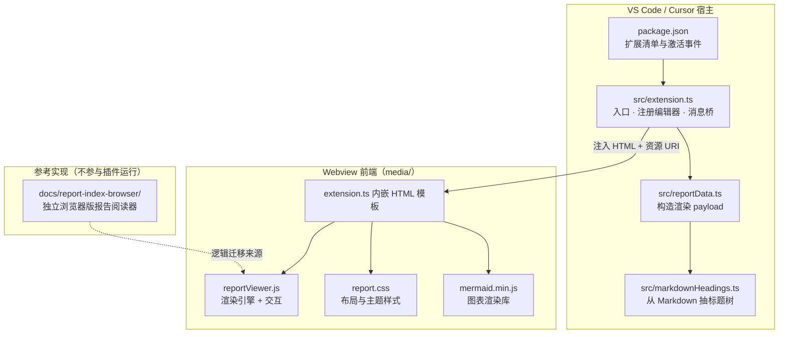
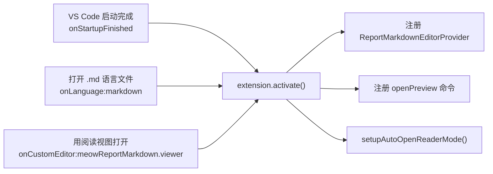
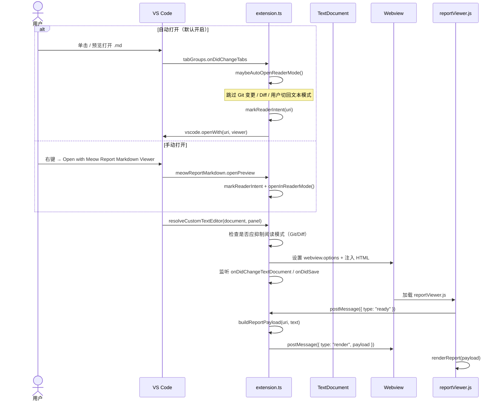
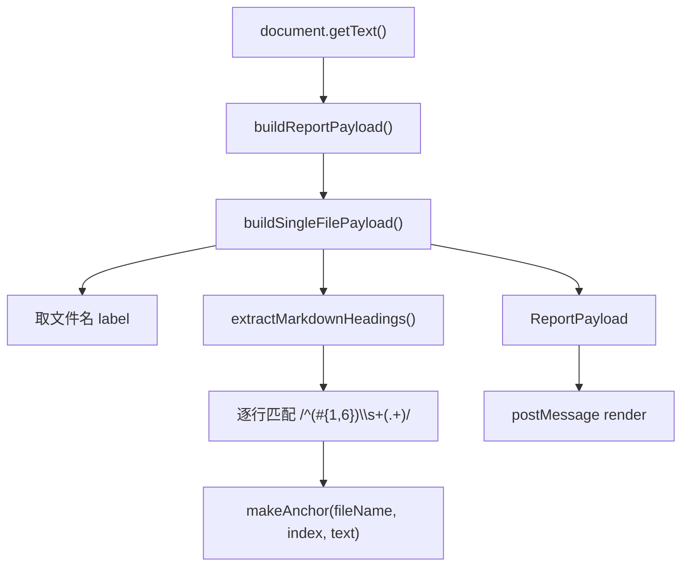
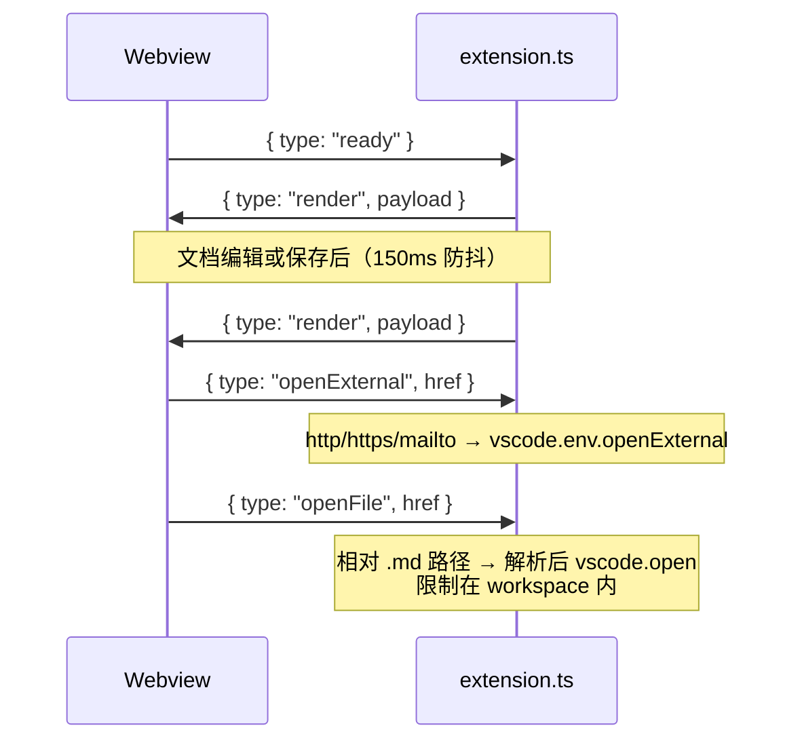
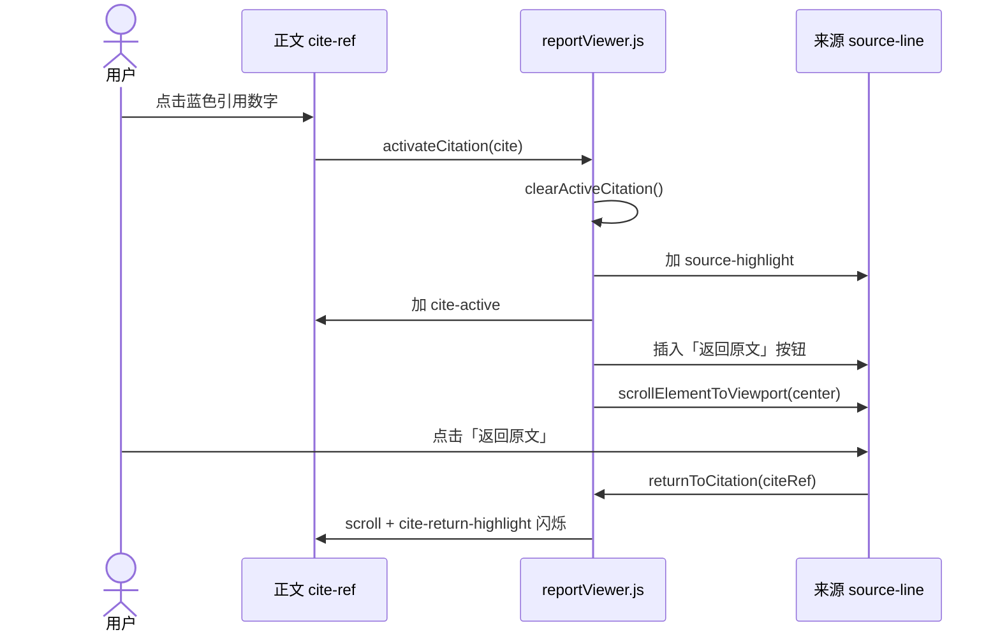
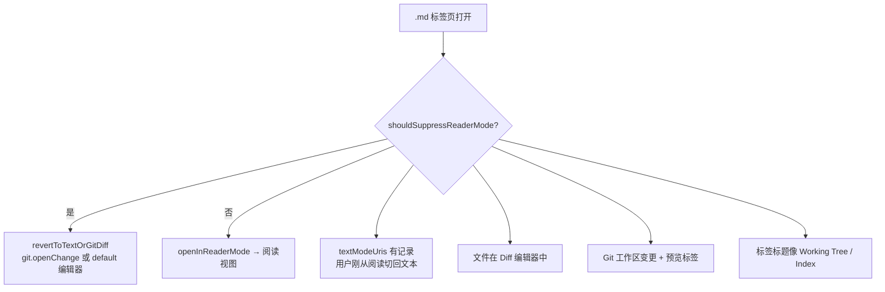
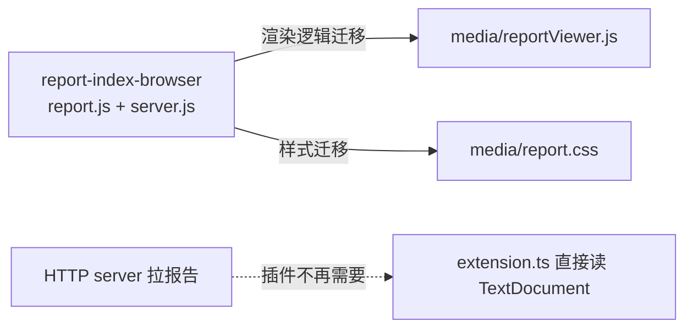
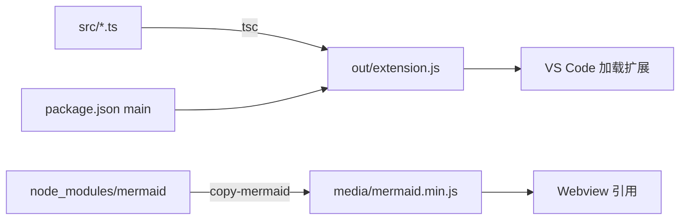

# Meow Report Markdown Viewer — 项目架构与运行流程

> 喵～这份文档用 **Mermaid（美人鱼）语法** 画架构图，帮你一眼看懂：插件怎么跑起来、模块怎么互相牵手、Markdown 怎么变成页面、以及「点一下会发生什么」。

---

## 1. 一句话概括123

这是一个 **VS Code / Cursor 扩展**：用 `CustomTextEditorProvider` 把 `.md` 文件在编辑器中间区域以 **Webview 阅读视图** 打开；扩展主进程负责读文件、抽标题、推数据，Webview 负责渲染目录、正文、引用跳转和 Mermaid 图表。

---

## 2. 仓库模块地图




| 模块   | 路径                        | 职责                                                    |
| ---- | ------------------------- | ----------------------------------------------------- |
| 扩展入口 | `src/extension.ts`        | 注册 Custom Editor、自动打开逻辑、Git/Diff 抑制、Webview HTML、双向消息 |
| 数据层  | `src/reportData.ts`       | 把当前 `TextDocument` 转成 `ReportPayload`（单文件模式）          |
| 标题解析 | `src/markdownHeadings.ts` | 正则提取 `#`～`######` 标题，生成 `anchor`                      |
| 渲染引擎 | `media/reportViewer.js`   | 行级 Markdown 解析、TOC 构建、cite 跳转、Mermaid、阅读设置            |
| 样式   | `media/report.css`        | 双栏布局、目录、引用高亮、Mermaid 弹层                               |
| 扩展清单 | `package.json`            | `customEditors`、`commands`、`configuration`            |


---

## 3. 插件是怎么跑起来的

### 3.1 激活时机




### 3.2 打开一个 `.md` 文件的完整链路




**关键设计点：**

- `ready` 消息必须在 HTML 加载**之前**注册监听器，否则首轮渲染会丢（`extension.ts` 注释已写明）。
- `openInReaderMode` 会先 `ensureTextDocumentReady`，再带退避重试 `vscode.openWith`——这是为了绕过 Cursor 上 Custom Editor 的已知断言问题。
- `readerIntentUris` / `textModeUris` 两套 Set 用来区分「用户明确要阅读」和「用户明确要文本/Diff 模式」，避免自动打开和 Git 工作区冲突。

---

## 4. 渲染管线：从 Markdown 字符串到 DOM

### 4.1 主进程侧（TypeScript）




`ReportPayload` 结构：

```ts
{
  ok: true,
  title: string,      // 文件名
  meta: string,
  rootUri: string,    // 文档 URI
  files: [{
    name, label, uri, content,
    headings: [{ level, text, line, anchor }]
  }]
}
```

> 当前版本是 **单文件渲染**：`files` 数组里只有当前打开的那一个 `.md`，不会扫描同目录其他文件。

### 4.2 Webview 侧（reportViewer.js）

```mermaid
flowchart TD
  R["renderReport(payload)"] --> CLEAR["清空 toc / reportContent<br/>关闭 Mermaid 弹层"]
  CLEAR --> NUM["withOutlineNumbers()<br/>给标题加 1.2.3 编号"]
  NUM --> LOOP["遍历每个 file"]

  LOOP --> TOC["createFileToc()"]
  TOC --> TREE["buildHeadingTree() 建树"]
  TREE --> BRANCH["createTocBranch() 可折叠目录项"]

  LOOP --> FILE["renderFile()"]
  FILE --> MD["renderMarkdown() 行扫描器"]

  MD --> PRE["preprocessMarkdownContent()<br/>脚注 / 定义列表预处理"]
  PRE --> SCAN["逐行状态机"]
  SCAN --> H["标题 h1-h6 + id=anchor"]
  SCAN --> P["段落 / 列表 / 表格"]
  SCAN --> CODE["代码块"]
  SCAN --> CITE["[cite source] 来源行"]
  SCAN --> MERBLOCK["```mermaid 代码块"]

  SCAN --> INLINE["appendInlineMarkdown()<br/>粗体/斜体/链接/[cite:n]/脚注"]
  MERBLOCK --> HYDRATE["hydrateMermaid()<br/>mermaid.render() → SVG"]
  HYDRATE --> DONE["updateActiveToc() 同步目录高亮"]
```


### 4.3 `renderMarkdown` 行扫描器在干什么

可以理解为一只勤劳的喵在逐行读稿：


| 遇到的内容                 | 输出 DOM                                      |
| --------------------- | ------------------------------------------- |
| `#`～`######` 标题       | `<h1>`～`<h6>`，带 `id={anchor}` 和可选编号         |
| 普通文本行                 | 累积进段落，空行时 `flushParagraph`                  |
| `| ... |` 表格行         | `renderTable`                               |
| ````lang`             | 进入代码块模式；`lang=mermaid` 时生成 `.mermaid-block` |
| `[cite source] n.`    | `.source-line`，带 `id` 供引用跳转                 |
| `>` 引用块 / 定义列表 / 任务列表 | 对应块级渲染器                                     |
| 行内 `[cite: 1,2]`      | `.cite-ref` 蓝色数字按钮                          |
| 行内链接                  | `<a href="...">`                            |


Mermaid 分两阶段：

1. **解析阶段**：`flushCode` 遇到 `mermaid` 语言，只建占位块 + 右上角全屏按钮。
2. **水合阶段**：`hydrateMermaid` 异步调用 `mermaid.render`，把 SVG 塞进 `.mermaid-content`。

---

## 5. 扩展主进程 ↔ Webview 消息协议




---

## 6. 用户操作 → 会发生什么

### 6.1 总览交互图

```mermaid
flowchart TB
  CLICK["用户点击 / 滚动 / 拖动"]

  CLICK --> CITE["cite 引用数字 .cite-ref"]
  CLICK --> RET["返回原文 .source-return"]
  CLICK --> TOC_LINK["目录链接 a[data-anchor]"]
  CLICK --> TOC_FOLD["目录折叠按钮 .toc-fold"]
  CLICK --> ANCHOR["正文内 # 锚点链接"]
  CLICK --> EXT_LINK["http(s) / mailto 链接"]
  CLICK --> MD_LINK["相对路径 other.md"]
  CLICK --> MER_BTN["Mermaid 全屏按钮"]
  CLICK --> SET["阅读设置齿轮"]
  CLICK --> TOC_TOGGLE["收起/展开目录"]
  CLICK --> TOC_RESIZE["拖动目录右边缘"]
  CLICK --> SCROLL["滚动正文 / 目录"]

  CITE --> A1["activateCitation<br/>高亮来源 + 滚动 + 显示返回按钮"]
  RET --> A2["returnToCitation<br/>滚回引用处 + 闪烁高亮"]
  TOC_LINK --> A3["scrollToAnchor<br/>暂停 scroll-spy + 平滑滚动"]
  TOC_FOLD --> A4["toggleTocBranch<br/>折叠/展开子目录"]
  ANCHOR --> A3
  EXT_LINK --> A5["postMessage openExternal<br/>系统浏览器打开"]
  MD_LINK --> A6["postMessage openFile<br/>VS Code 打开目标 md"]
  MER_BTN --> A7["openMermaidModal<br/>全屏 + 缩放/拖动"]
  SET --> A8["字号/编号/彩虹标题等<br/>写入 localStorage"]
  TOC_TOGGLE --> A9["setTocCollapsed<br/>切换 layout class"]
  TOC_RESIZE --> A10["更新 --toc-width<br/>写入 localStorage"]
  SCROLL --> A11["updateActiveToc<br/>目录跟随高亮当前标题"]
```




### 6.2 操作明细表


| 用户操作             | 触发元素 / 事件              | 处理函数                                 | 结果                                                                             |
| ---------------- | ---------------------- | ------------------------------------ | ------------------------------------------------------------------------------ |
| 点击引用 `[cite: n]` | `.cite-ref`            | `activateCitation`                   | 清除旧高亮 → 来源行 `.source-highlight` → 正文 cite `.cite-active` → 平滑滚到来源 → 插入「返回原文」按钮 |
| 点击「返回原文」         | `.source-return`       | `returnToCitation`                   | 滚回引用按钮 → `.cite-return-highlight` 闪烁约 1.2s                                     |
| 点击目录项            | `a[data-anchor]`       | `scrollToAnchor`                     | 暂停目录 scroll-spy 约 900ms → 展开祖先节点 → 正文滚到对应 `id`                                 |
| 点击目录 ▸/▾         | `.toc-fold`            | `toggleTocBranch`                    | 切换 `data-collapsed`，子目录显示/隐藏                                                   |
| 点击 `#anchor` 链接  | 正文 `<a href="#...">`   | `scrollToAnchor`                     | 页内跳转，不刷新                                                                       |
| 点击外部链接           | `https://` / `mailto:` | `handleReportClick` → `openExternal` | 扩展调用 `vscode.env.openExternal`                                                 |
| 点击相对 `.md` 链接    | `other.md` / `./x.md`  | `handleReportClick` → `openFile`     | 扩展解析相对路径，`vscode.open` 打开（限 workspace 内）                                       |
| 点击 Mermaid 全屏    | `.mermaid-expand-btn`  | `openMermaidModal`                   | 弹层显示 SVG；支持滚轮缩放、左键拖动、Esc 关闭                                                    |
| 滚动正文             | `window scroll`        | `updateActiveToc`                    | 50ms 节流；根据视口参考线高亮最近经过的标题                                                       |
| 在目录区滚轮           | `toc wheel`            | `initTocWheelIsolation`              | 目录滚到顶/底时 `preventDefault`，不带动正文                                                |
| 拖动目录宽度           | `#tocResizeHandle`     | `initTocResize`                      | 更新 CSS 变量 `--toc-width`，存入 `localStorage`                                      |
| 收起/展开目录          | `#tocToggle`           | `setTocCollapsed`                    | 切换 `layout-toc-open/collapsed`，状态持久化                                           |
| 改字号 / 编号开关       | 阅读设置面板                 | `applyReaderSettings`                | 改 `documentElement` 上的 CSS 变量与 class                                           |
| 编辑并保存 `.md`      | VS Code 文本变更           | `scheduleUpdate`（150ms）              | 重新 `buildReportPayload` → 整页重渲染                                                |


### 6.3 引用（cite）跳转小剧场




来源行在 Markdown 里长这样（见 `docs/markdown_format_spec.md`）：

```markdown
[cite source] 1. 某条参考文献说明……
```

正文里写 `[cite: 1]` 会渲染成可点的蓝色数字。

---

## 7. 自动打开 vs 抑制阅读模式

插件默认 `meowReportMarkdown.autoOpenReaderMode: true`。下列情况会 **不自动** 用阅读视图，或打开后 **立刻退回** 文本/Git Diff：




用户从阅读视图切回文本编辑器时，`textModeUris` 会记下该 URI，之后同一文件不再自动抢回阅读模式。

---

## 8. 状态持久化（localStorage）

阅读偏好和布局存在 Webview 的 `localStorage`，不经过扩展主进程：


| Key                                       | 含义         |
| ----------------------------------------- | ---------- |
| `meowReportMarkdown.tocCollapsed`         | 目录是否收起     |
| `meowReportMarkdown.tocWidth`             | 目录栏宽度      |
| `meowReportMarkdown.fontScale`            | 正文字号比例     |
| `meowReportMarkdown.showTocNumbers`       | 目录是否显示编号   |
| `meowReportMarkdown.showContentNumbers`   | 正文标题是否显示编号 |
| `meowReportMarkdown.headingFontScale`     | 标题是否逐级缩小   |
| `meowReportMarkdown.rainbowHeadingColors` | 彩虹标题色      |


---

## 9. 与 `docs/report-index-browser` 的关系




浏览器版通过 `server.js` 聚合多文件报告；**当前插件版已简化为单文件**，但 DOM 结构、cite 协议、TOC 交互仍与浏览器版一脉相承。调试 UI 时也可对照 `docs/report-index-browser/`。

---

## 10. 编译与运行依赖




本地开发：`npm install` → `npm run compile` → F5 **Run Extension** → 在新窗口打开 `docs/fixtures/cite-demo.md` 验收。

---

## 11. 相关文档


| 文档                                                                                                    | 内容                   |
| ----------------------------------------------------------------------------------------------------- | -------------------- |
| [markdown_reader_plan.md](../markdown_reader_plan.md)                                                 | 更完整的设计方案与历史决策        |
| [p0-feature-development-plan.md](./p0-feature-development-plan.md)                                    | P0 功能拆分与验收标准         |
| [markdown_format_spec.md](../markdown_format_spec.md)                                                 | cite 与扩展 Markdown 语法 |
| [how-to-release&update-local&extension-market.md](../how-to-release&update-local&extension-market.md) | F5 调试、打包、发版          |


---

*文档版本：与仓库当前单文件阅读实现同步。若后续加入多文件聚合或 Webview 内编辑，请回来更新第 4、5 节喵～*