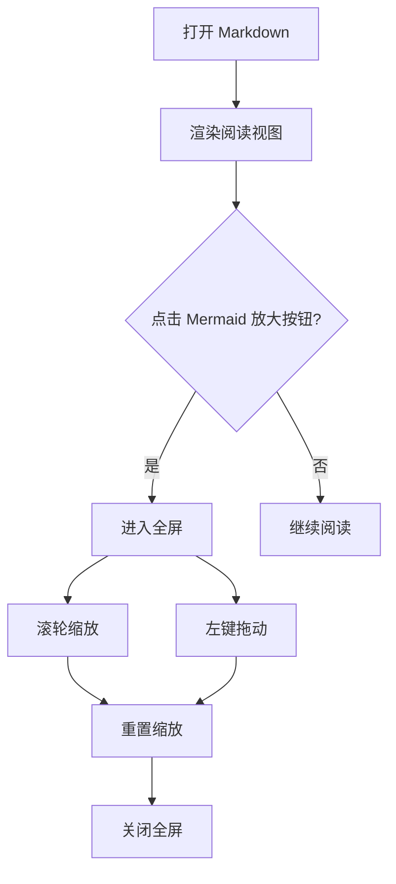
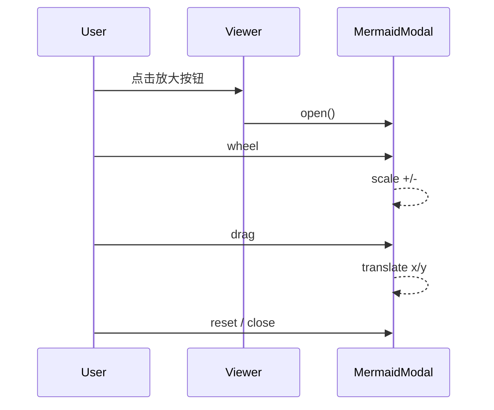

# Markdown Reader 全功能验收 Demo

这个文档用于在 **阅读渲染模式** 下一次性验证当前插件的主要能力（已完成 + 进行中功能）。

建议测试顺序：

1. 先从上到下浏览，确认基础渲染与目录行为。

2. 再重点测 Mermaid 全屏交互、cite 跳转、内链跳转与返回来源。

3. 最后进入编辑模式修改几行文本并保存，确认读写链路。

---

## 2. 链接行为（外链/相对路径/内链）

### 2.2 文档内锚点跳转（含返回来源）

说明：以下直接使用“标题锚点”做测试，保证跳转目标就是标题本身，便于验证“返回来源位置”链路。

点击这个内链跳转并再返回：  
[跳转到 Mermaid 区并返回](#full-feature-demo-9-3-mermaid-渲染与全屏交互-f2)

目标：

再测一次，确认连续操作不串位：  
[跳转到 Cite 区并返回](#full-feature-demo-12-4-cite-跳转与返回原文)

---

- 外链走系统浏览器。

- 相对 `.md` 链接在阅读器中打开对应文档（支持 `../` 跨目录）。

- 文档内锚点可跳转。

### 2.1 外链与相对路径

- 外部链接示例：[OpenAI](https://openai.com)

- 同目录 Markdown 链接：[打开 cite-demo](./cite-demo.md)
- Obsidian 双链（同目录）：[[cite-demo]]、[[extended-markdown-demo|扩展语法 demo]]
- 同目录相对链接：[打开扩展语法 demo](./extended-markdown-demo.md)

### 2.1.1 跨目录跳转（上级文件夹）

本文件位于 `docs/fixtures/`，以下链接用于验证跳转到其他目录的 Markdown 文件（应在阅读器中打开）：

- 上一级 `docs/`：[打开 markdown_reader_plan](../markdown_reader_plan.md)
- 项目根目录：[打开 README](../../README.md)
- Obsidian 双链（跨目录）：[[../markdown_reader_plan|开发计划文档]]、[[../../README|项目 README]]
- 相对路径 + 双链混用：[格式规范](../markdown_format_spec.md)、[[../develop/project-architecture|架构说明]]

## 1. 目录与标题结构（F4/F3 回归）

目标：

- 文件名不应被当作正文一级标题。

- `#` 应显示为正文最高级标题（不是被整体降级）。

- 目录在边界滚动时不应串滚正文。

### 1.1 多级标题树

#### 1.1.1 三级标题 A

目录应出现这条 3 级节点。

#### 1.1.2 三级标题 B

继续用于目录树展开/折叠测试。

### 1.2 滚动边界测试段

把鼠标放在左侧目录里连续滚动到顶/到底，再继续滚动，正文不应被带着滚动。

填充段落 1：用于制造一定滚动距离。  
填充段落 2：用于制造一定滚动距离。  
填充段落 3：用于制造一定滚动距离。  
填充段落 4：用于制造一定滚动距离。  
填充段落 5：用于制造一定滚动距离。  

为方便观察，这里放一些填充段落：

---

## 3. Mermaid 渲染与全屏交互（F2）

目标：

- Mermaid 正常渲染。

- 点击右上角放大按钮进入全屏。

- 全屏态支持滚轮缩放、左键拖动、重置、关闭。

### 3.1 流程图



### 3.2 时序图



---

## 4. Cite 跳转与返回原文

目标：

- `[cite: n]` 点击跳到对应 `[cite source] n`。

- 来源行按钮“返回原文”回到正确 cite。

测试点 A：普通段落中的 cite [cite: 11]。  
测试点 B：粗体中的 cite **[cite: 12]**。  
测试点 C：表格中的 cite 见下表 [cite: 13]。

| 测试项 | 行为预期 |
| --- | --- |
| cite 跳转 | 点击 [cite: 13] 跳到 Source 13 |
| 返回原文 | 从 Source 返回到当前单元格 |

---

## 5. 通用 Markdown 渲染回归

目标：验证常见 Markdown/GFM/扩展语法与现有功能共存。

### 5.1 列表与任务

目标：点击复选框可切换 `[ ]` / `[x]` 并自动保存到源文件。

- 普通无序列表项

- 另一个列表项

- [ ] 未完成任务

- [x] 已完成任务

### 5.1.1 表格内任务复选框

目标：表格单元格支持 `- [ ]` / `- [x]` 与 `[ ]` / `[x]` 两种写法，点击可写回源文件。

| 完成 | 名称 | 说明 |
| --- | --- | --- |
| - [x] | 列表写法 | 单元格为 `- [ ]` / `- [x]` |
| [x] | 括号写法 | 单元格为 `[ ]` / `[x]` |
| - [x] | 已完成示例 | 点击可切换为未完成 |

### 5.2 引用与删除线

> 引用块里包含 ~~删除线~~、**粗体**、*斜体* 和 [外链](https://example.com)。

### 5.3 脚注与定义列表

脚注示例[^full-note-1] 与命名脚注[^full-note-2]。

Engine
: 负责渲染与交互逻辑
: 当前测试目标包括目录、Mermaid、cite、内链返回

Reader
: 用户面向的阅读视图

### 5.4 代码块

```ts
function checkRenderState(ok: boolean): string {
  return ok ? "render-ok" : "render-failed";
}
```

带 shell 注释的代码块（`#` 不应被解析为标题）：

```bash
git clone https://github.com/hi-godot/godot-ai.git
# 将 plugin/addons/godot_ai 复制到你的项目 addons/ 目录
```

### 5.5 HTML 安全过滤回归

行内标签：<mark>高亮</mark>、<kbd>Ctrl</kbd>+<kbd>S</kbd>、x<sup>2</sup>。  
危险标签不应生效：<script>alert("xss")</script>

---

## 6. 编辑模式（F5-1）

目标：

- 可以进入编辑模式。

- 修改文本后“保存并预览”生效。

- 取消可放弃未保存改动。

建议在本节做如下动作：

1. 点击右下角“编辑”。

2. 把下一行文本改成你自己的标记内容。

3. 点击“保存并预览”，确认内容已经更新。

可编辑测试行（请修改我）：
`编辑测试初始值：2026-06-19`

---

## 7. 内链返回来源（F5-2）

目标：

- 点击正文中的锚点内链可跳转。

- 跳转后出现“返回来源”按钮。

- 点击“返回来源”可回到触发跳转的位置并高亮提示。

测试入口 1：[从这里跳到文档顶部](#full-feature-demo-0-markdown-reader-全功能验收-demo)  
测试入口 2：[从这里跳到编辑模式章节](#full-feature-demo-19-6-编辑模式-f5-1)

---

## 8. 正文折叠与目录联动（F6-1）

目标：

- 标题下方只要有正文内容（段落、列表等），悬停即可出现折叠按钮（▾/▸），不要求必须有子标题。

- 有子章节的标题：折叠正文时，左侧目录对应节点同步折叠。

- 无子章节的标题：可折叠其下正文，但左侧目录不联动（目录本身也不提供此类折叠）。

- 仅折叠目录时，正文内容不应被隐藏。

测试步骤：

1. 找到「1.1 多级标题树」，悬停标题并点击 ▾，确认 `1.1.1` / `1.1.2` 被隐藏，且左侧目录对应子项也收起。

2. 找到「1.2 滚动边界测试段」（无子标题、下方有多段正文），悬停并折叠，确认填充段落被隐藏，但目录中该条目不出现折叠按钮、状态不变。

3. 再仅通过目录展开第 1 步的节点，确认正文仍保持折叠。

4. 在正文重新展开各节，确认内容与目录均可正常恢复。

---

## 9. 模块拖动重排（F6-2）

目标：

- 标题块（含子内容）可在同级范围内拖动排序。

- 普通段落块可在同级范围内拖动排序。

- 拖动后自动保存，重新打开顺序保持一致。

测试步骤：

0. 打开右上角「阅读设置」→「交互」→ 开启「正文块拖动排序」（默认关闭）。

1. 找到「1.1.1 三级标题 A」与「1.1.2 三级标题 B」，悬停左侧空白栏出现 `⋮⋮` 拖动手柄。

2. 拖动其中一节到另一节上方/下方，松手后顺序应变，目录同步更新。

3. 找到「1.2 滚动边界测试段」下的填充段落，悬停段落左侧拖动手柄，尝试调换两段顺序。

4. 关闭并重新打开文档，确认新顺序仍保留。

已知限制（当前阶段）：

- 代码块、Mermaid、表格等块尚未开放拖动，仅参与序列化占位。

- 暂不支持跨层级拖动（例如把 h4 块拖到另一父级 h3 之外）。

---

## 来源

[cite source] 11. Source 11：普通段落 cite 测试 - https://example.com/source-11  

[cite source] 12. Source 12：粗体内 cite 测试 - https://example.com/source-12  

[cite source] 13. Source 13：表格内 cite 测试 - https://example.com/source-13