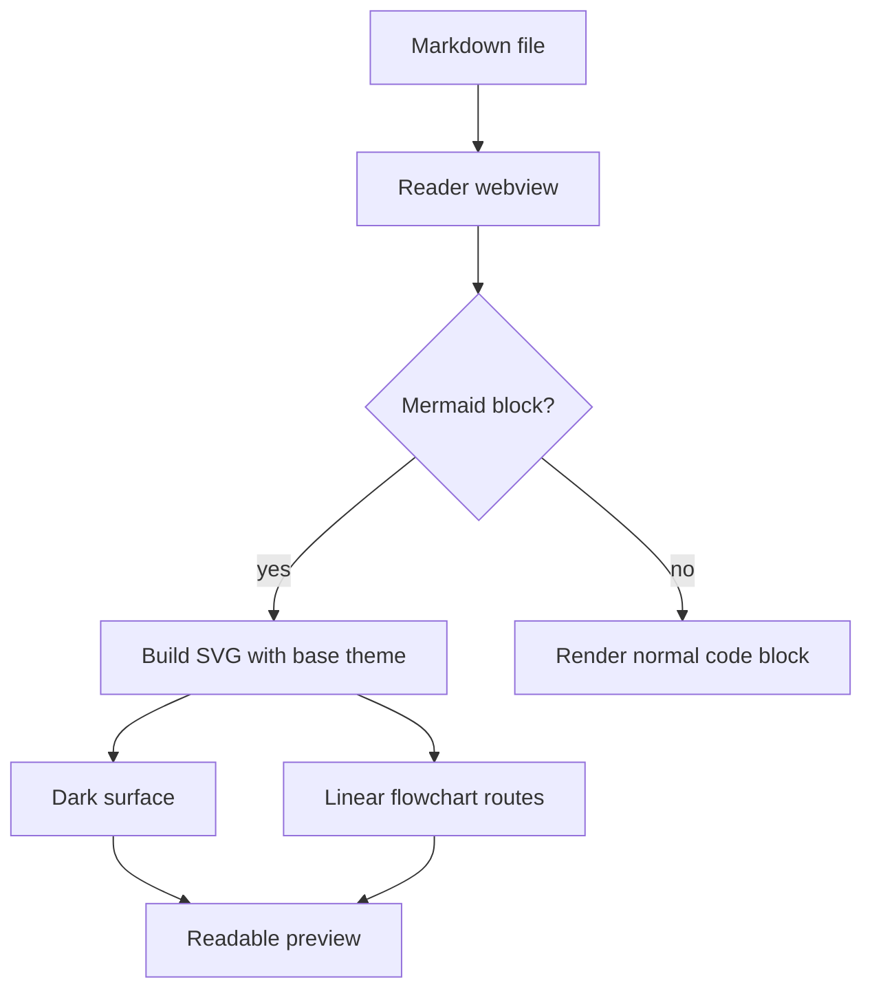
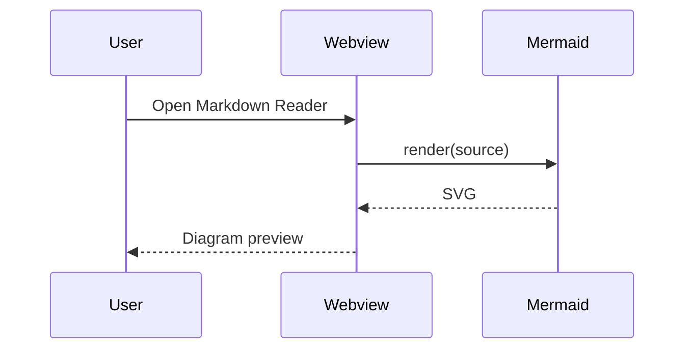

# Mermaid Cursor Style Demo

This fixture verifies the Markdown Reader Mermaid baseline:

- Default flowcharts use the reader-level Mermaid config.
- Flowchart edges should read as straight or angular routes, not soft decorative curves.
- Nodes should sit on a restrained dark surface with muted borders.
- Cyan edges and arrowheads should remain easy to follow in Cursor dark themes.
- Fullscreen preview should keep the same visual tone while preserving zoom and drag.

## Default Flowchart

## Sequence Diagram

## Diagram-Level Curve Override

