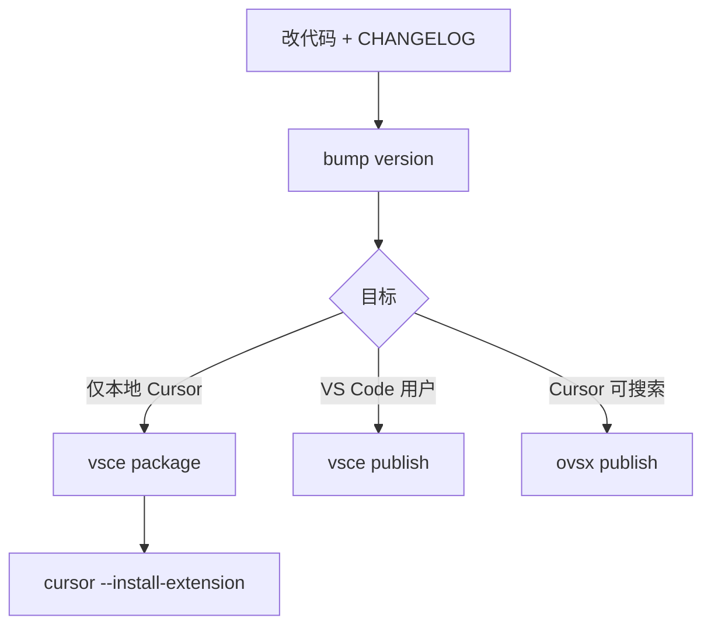

# Meow Report Markdown 格式规范

本文档描述 **Meow Report Markdown Viewer** 插件当前能识别并渲染的 Markdown 写法。其他工具或 AI 生成带引用来源的报告时，请按此规范输出，以保证阅读视图、目录跳转和 cite 交互正常工作。

测试样例：

- `docs/fixtures/cite-demo.md` — cite 跳转行为
- `docs/fixtures/tomodachi-cite-demo.md` — 完整报告 + 多来源
- `docs/fixtures/extended-markdown-demo.md` — 引用块、删除线、任务列表、脚注、定义列表、HTML
- `docs/fixtures/full-feature-demo.md` — 内链跳转返回、任务列表交互、Mermaid 全屏等综合验收

---

## 1. 总体说明

插件使用**自定义逐行解析器**，不是完整 CommonMark 实现。只支持下列子集；未列出的语法会按普通段落文本处理。

解析优先级（从上到下）：

1. 代码块围栏
2. 表格行
3. **来源行**（`[cite source]`）
4. 标题（`#`）
5. 空行
6. 引用块（`>`）
7. 单行 HTML 块
8. 定义列表
9. 任务列表 / 普通列表
10. 普通段落

行内格式在段落、列表、表格、引用块、定义列表、来源行内二次解析。脚注定义行（`[^id]:`）在预处理阶段提取，不参与上述块级优先级。

---

## 2. 标题

### 写法

```markdown
# 一级标题
## 二级标题
### 三级标题
```

最多支持 6 个 `#`。行尾可选 Markdown 锚点标记（` ##`）会被剥掉。

### 渲染规则

- 文件最上方自动渲染一个 `<h1>`（文件名），因此正文里 `#` 标题在页面上显示为 **h2**，`##` 显示为 **h3**，以此类推。
- 标题会自动编号，例如 `1.2.3 标题文字`。
- 若标题本身已带编号前缀，渲染前会剥掉：
  - 中文：`第一章`、`第2节` 等
  - 数字：`1.`、`1.2`、`1、` 等

### 目录（TOC）

- 扩展端用同一套 `#` 正则提取标题，生成左侧目录。
- 目录项可折叠，滚动正文时会高亮当前段落对应条目。
- 目录链接锚点 id 由 `文件名 + 序号 + 标题文字` 生成 slug。

---

## 3. 引用（正文 cite）

### 写法

正文中的引用标记：

```markdown
[cite: 1]
[cite:3]
[cite: 1, 2, 3]
```

规则：

- 大小写不敏感
- `:` 后可有可无空格
- 多个编号用英文逗号分隔
- **不要**写在行内代码（反引号）里，否则不会被识别

### 渲染效果

- 原文中的 `[cite:`、`]` 和逗号**不会显示**。
- 只渲染为蓝色可点击数字按钮（`.cite-ref`）。
- 多个编号时并排显示多个数字按钮。

### 交互

1. 点击正文数字 → 滚动到文末对应编号的来源行，并高亮。
2. 来源行右侧出现「返回原文」按钮。
3. 点击返回 → 滚回刚才点击的那个 cite 按钮（按 DOM id 定位，不是按编号反推）。

### 配对要求

正文 `[cite: n]` 必须在文末有对应编号的 `[cite source]` 来源行，否则点击无效。

---

## 4. 来源（文末 source）

### 写法

**每一行来源都必须以 `[cite source]` 或 `[cite-source]` 开头**，不再识别硬编码的 `Sources:` 标题来切换「来源模式」。

```markdown
## 来源

[cite source] 1. 标题或描述 — 补充说明 - https://example.com/page
[cite source] 2. 另一条来源 - https://example.org/article
```

行格式（整行 trim 后匹配）：

```text
[cite source] <编号>. <正文内容>
[cite-source] <编号>. <正文内容>
```

- `[cite source]` / `[cite-source]`：大小写不敏感
- `<编号>`：正整数，与正文 `[cite: n]` 对应
- `<正文内容>`：来源描述，可含链接、粗体等行内格式

### 渲染效果

- 行首的 `[cite source]` 标记**不会显示**。
- 渲染为带编号的来源行（`.source-line`），并生成跳转锚点 id：`source-<文件名slug>-<编号>`。
- 来源行正文里的 `[cite: n]` **不会**再被解析为可点击按钮。

### 章节标题

来源区域前的标题（如 `## 来源`、`## Sources`、`**来源**`）按普通 Markdown 渲染，**没有**特殊语义。是否出现、写什么文字，由作者自行决定。

---

## 4.5 文档内锚点跳转（内链）

### 写法

正文中的页面内链接：

```markdown
[跳转到 Mermaid 章节](#demo-anchor-mermaid)
[回到顶部](#demo-anchor-top)
```

也可用 HTML 显式锚点（经 HTML 块白名单过滤后保留 `id`）：

```markdown
<span id="demo-anchor-mermaid"></span>
```

常见锚点来源：

| 来源 | 示例 id | 说明 |
|------|---------|------|
| Markdown 标题 | 由 `文件名 + 序号 + 标题文字` 生成 slug | 与左侧目录 `data-anchor` 一致 |
| HTML `id` | `demo-anchor-mermaid` | 适合跳转到章节内任意位置 |
| 脚注 | `fn-<fileKey>-<n>` / `fnref-<fileKey>-<n>` | 脚注上标与返回链接互跳 |

### 渲染效果

- `[文字](#anchor)` 渲染为 **蓝色底圆角链接**（复用 `.cite-ref` 样式），不是普通下划线超链接。
- 目录项、脚注上标/返回链接等同理：凡指向 `#...` 的正文内链，均使用同一视觉风格。

### 交互（与 cite 引用同源样式）

1. 点击正文内链 → 来源链接变为深蓝激活态（`.cite-active`）→ 平滑滚动到目标锚点。
2. 目标区域出现 **蓝色边框 + 浅蓝底高亮框**（`.jump-target` + `.source-highlight`，与来源行高亮一致）。
3. 高亮框右侧出现 **「返回来源」** 按钮（`.source-return`）。
4. 点击「返回来源」→ 滚回刚才点击的内链位置 → 内链 **闪烁两下**（`.cite-return-highlight` 动画）。

### 与 cite 的区别

| 能力 | cite `[cite: n]` | 内链 `[文字](#anchor)` |
|------|------------------|------------------------|
| 来源样式 | 蓝色数字按钮 | 蓝色底文字链接 |
| 目标高亮 | 来源行 `.source-line` | 任意锚点元素 `.jump-target` |
| 返回按钮文案 | 「返回原文」 | 「返回来源」 |
| 返回后闪烁 | cite 数字按钮 | 内链链接 |
| 目录点击 | 仅滚动，不触发返回来源流程 | 同左 |

### 配对要求

- 目标 `id` 必须在当前文档渲染结果中存在，否则点击无效。
- 相对路径 `.md` 链接、外链 `https://` 不走此流程，分别走「编辑器打开文件」与「系统浏览器」。

---

## 5. 完整引用示例

```markdown
## 结论

玩家拖动 Mii 可强制发起对话 [cite: 1]，hangout 场景会揭示关系动态 [cite: 2]。

## 来源

[cite source] 1. Game8 — Relationships Guide — 拖动互动机制 - https://example.com/1
[cite source] 2. Living The Grid — Mii Guide — hangout cutscene 说明 - https://example.com/2
```

阅读视图中正文显示为：

> 玩家拖动 Mii 可强制发起对话 **1**，hangout 场景会揭示关系动态 **2**。

（其中 **1**、**2** 为蓝色数字按钮，不是字面方括号文本。）

---

## 6. 段落

- 连续非空行合并为一个段落。
- 空行结束当前段落。

---

## 7. 列表

### 无序列表

```markdown
- 项目一
* 项目二
+ 项目三
```

### 有序列表

```markdown
1. 第一项
2. 第二项
```

### 任务列表

```markdown
- [ ] 未完成
- [x] 已完成
```

- 支持 `[ ]`、`[x]`、`[X]`
- 阅读视图中复选框 **可点击切换**，会即时写回源 `.md` 并自动保存
- 切换规则：未完成 `[ ]` ↔ 已完成 `[x]`（写入时统一为小写 `x`）
- 引用块（`>`）内的任务列表同样支持交互，保留 `>` 前缀
- 编辑模式（全文 textarea）下复选框只读，请在阅读视图操作

注意：普通有序列表**不会**自动变成来源锚点。只有带 `[cite source]` 前缀的行才是来源。

---

## 8. 引用块

### 写法

```markdown
> 引用段落第一行
> 第二行仍属于同一段

> 空 `>` 行开启新段落
```

### 渲染规则

- 连续 `>` 行合并为一个 `<blockquote>`
- 引用内支持 cite、链接、粗体等行内格式

---

## 9. 定义列表

### 写法

```markdown
术语
: 释义一
: 释义二

下一术语
: 释义
```

- 术语行后紧跟以 `:` 开头的释义行
- 同一术语可有多条 `: ` 释义

---

## 10. 脚注

### 写法

正文引用：

```markdown
见说明[^note-id]
```

文末或任意位置定义（该行不会出现在正文流中）：

```markdown
[^note-id]: 脚注正文，可含 **粗体** 等行内格式
```

- 正文渲染为上标数字链接
- 被引用的脚注在文档末尾列出，带 ↩ 返回链接
- 未定义的 `[^id]` 保留原文

---

## 11. HTML 标签

### 支持范围

- **块级单行**：整行以允许的标签开头并闭合，如 `<details>...</details>`、`<hr>`
- **行内标签**：段落内的 `<mark>`、`<kbd>`、`<sub>`、`<sup>` 等

### 安全策略

- 允许常见语义标签（`strong`、`em`、`details`、`summary`、`mark`、`kbd` 等）
- 过滤 `script`、`iframe`、`style`、`form` 等危险标签
- 剥离 `on*` 事件属性；链接仍遵循行内链接安全策略

---

## 12. 表格

### 写法

```markdown
| 列 A | 列 B |
| --- | --- |
| 单元格 | 单元格 |
```

规则：

- 行首尾必须是 `|`
- 一行中至少 2 个 `|`
- 第二行为 `---` 分隔符时，第一行作为表头

单元格内支持 cite、链接、粗体等行内格式。

---

## 13. 代码

### 围栏代码块

````markdown
```语言可选
代码内容
```
````

围栏内不做 cite、链接等行内解析。

### 行内代码

```markdown
`code`
```

---

## 14. 行内格式

在段落、列表、表格、来源行正文中支持：

| 语法 | 渲染 |
|------|------|
| `**粗体**` | 粗体 |
| `*斜体*` | 斜体 |
| `~~删除线~~` | 删除线 |
| `` `行内代码` `` | 等宽代码 |
| `[文字](url)` | 超链接 |
| `https://...` | 裸 URL 自动变链接 |
| `[^id]` | 脚注上标（需有对应定义） |

### 链接安全策略

- 允许：`http://`、`https://`、`mailto:`
- 相对 `.md` 链接：在 VS Code 内打开对应文件
- `#anchor`：页面内跳转，样式与交互见 [§4.5 文档内锚点跳转](#45-文档内锚点跳转内链)
- `javascript:` 等危险协议：不渲染为链接，保留原文

---

## 15. 生成文档检查清单

生成或迁移报告时，请确认：

- [ ] 正文引用统一写 `[cite: n]`，编号与来源一致
- [ ] 每条来源独立一行，以 `[cite source] n.` 开头
- [ ] 内链目标 id 与 `[文字](#anchor)` / HTML `id` 一致，便于返回来源交互
- [ ] 不再依赖 `Sources:` 单独一行来触发来源识别
- [ ] 来源区可用任意标题（`## 来源` 等），标题本身无特殊语法
- [ ] 来源行正文避免写 `[cite: n]`（会被忽略，但容易混淆）
- [ ] 标题用 `#` / `##` 层级，便于目录生成
- [ ] 任务列表用 `- [ ]` / `- [x]`，便于阅读视图直接勾选
- [ ] 表格、代码块、列表按上文子集格式书写

---

## 16. 不支持或部分支持的内容

以下 CommonMark / GFM 特性**当前不支持**：

- 图片（``）
- 嵌套列表的复杂缩进规则
- 多行 HTML 块（未闭合的跨行标签）
- 完整 CommonMark 自动编号脚注等扩展

如需扩展支持，请在插件仓库中修改 `media/reportViewer.js` 并同步更新本文档。
---
tags:
  - Meta
  - tech
  - VSCode
  - Cursor
date: 2026-06-18
research_query: VS Code 扩展本地安装（Cursor）与 Marketplace / Open VSX 发布的最新流程与变化
research_rounds: 2
source_count: 12
---

# VS Code 扩展：本地安装（Cursor）与商城发布指南

## 摘要

本文面向 **Markdown 阅读器 / Meow Report Viewer** 等 VS Code 扩展项目，基于 2025–2026 年官方文档与 Cursor 社区信息，说明：① 在 **Cursor** 本地安装与调试；② 发布到 **Visual Studio Code Marketplace**；③ 同步发布 **Open VSX** 供 Cursor 搜索安装；④ 两渠道下的更新策略。关键变化：**Marketplace 网页已移除「Download Extension」按钮**（须在 VS Code/Cursor 扩展视图右键下载 VSIX，或走 Open VSX / API URL）[cite:1][cite:2]；**vsce 打包时会扫描密钥与 `.env`**，误报可显式放行 [cite:3]；**Azure DevOps 全局 PAT 将于 2026-12-01 退役**，CI 发布宜迁移 **Microsoft Entra ID** [cite:4]；Open VSX 发布现需 **Eclipse 账号 + Publisher Agreement** [cite:5]。

## 关键词

VS Code 扩展、Cursor、vsce、vsix、Open VSX、Marketplace、Entra ID、密钥扫描、本地安装、版本更新

## 相关文档索引

- [[MarkdownSideBar]] — 关联点：侧边栏 Markdown 阅读器产品需求
- [[CommonMark 与 GFM 规范调研]] — 关联点：阅读器应支持的 Markdown 语法层级
- [[VS Code扩展本地安装与发布指南]] — 关联点：本文（2026-06 再调研更新版）
- [[Skill 体系与关联关系]] — 关联点：文档生产三层流水线

---

## 适用场景

- 开发 Markdown 阅读器扩展，想先在 **Cursor** 自用
- 稳定后发布到 **VS Code Marketplace**，并视需要同步 **Open VSX**
- 需要厘清：本地怎么更新、商城怎么发版、Cursor 为何搜不到刚发的扩展

---

## 一、前置准备

### 1.1 扩展项目必备结构

| 文件/目录 | 作用 |
|-----------|------|
| `package.json` | 清单：`name`、`publisher`、`version`、`engines.vscode`、`contributes` 等 [cite:6] |
| `src/` 或 `extension.ts` | 扩展主逻辑 |
| `README.md` | 商城展示页 |
| `CHANGELOG.md` | 版本变更（商城 Changelog 页） |
| `icon.png` | 128×128 PNG（**勿用 SVG**）[cite:4] |

`package.json` 关键字段：

```json
{
  "name": "meow-report-viewer",
  "displayName": "Meow Report Viewer",
  "publisher": "your-publisher-id",
  "version": "0.1.0",
  "engines": { "vscode": "^1.85.0" },
  "main": "./out/extension.js",
  "repository": { "type": "git", "url": "https://github.com/you/repo.git" }
}
```

- **`publisher`**：与 Marketplace Publisher ID 一致，创建后**不可改** [cite:4]
- **`engines.vscode`**：声明兼容 API 版本；Cursor 安装时也会校验 [cite:7]

### 1.2 开发工具

```bash
node -v                    # 建议 LTS 20+；vsce 最新版倾向 Node 22+ [cite:8]
npm install -g @vscode/vsce
npm install -g ovsx        # 若要发 Open VSX
```

首次创建可用 `yo generator-code` 脚手架 [cite:4]。

### 1.3 本地开发是否需要 Publisher？

**不需要**。F5 调试或 `vsce package` 本地装 `.vsix` 均无需 PAT / Publisher；Publisher 仅在**首次上架商城**时需要 [cite:4]。

---

## 二、本地安装到 Cursor

Cursor 与 VS Code 共用扩展 API 与 `.vsix` 格式 [cite:7]，但内置市场不同（见第四节）。

### 方式 A：F5 调试（日常首选）

1. 用 Cursor 打开扩展项目根目录
2. 按 **F5** → 新开 **Extension Development Host** 窗口
3. 在该窗口验证功能；改代码后 **Developer: Reload Window**

不污染日常扩展列表，无需打包。

### 方式 B：打包 `.vsix` 后安装（接近真实环境）

```bash
npm install
npm run compile          # 若有 TS 编译
vsce package             # 生成 name-version.vsix
```

安装（任选）：

```bash
cursor --install-extension ./meow-report-viewer-0.1.0.vsix
# 或加 --force 覆盖同版本
```

图形界面：`Cmd+Shift+P` → **`Extensions: Install from VSIX...`**，或将 `.vsix` **拖入**扩展面板 [cite:9]。

### 方式 C：从已安装扩展目录复制（离线分发）

若机器上已有同扩展（如便携版 VS Code），可在 `data/extensions`（路径因安装方式而异）找到扩展目录再 `vsce package` [cite:10]。一般不如 A/B 常用。

### 本地验证清单（Meow 阅读器）

- [ ] `[cite:x]` / `[cite source]` 跳转是否正常
- [ ] 侧边栏 TOC 层级（对照 [[MarkdownSideBar]]）
- [ ] CommonMark / GFM 渲染范围（见 [[CommonMark 与 GFM 规范调研]]）

### 注意：手动 VSIX **不会自动更新**

Marketplace / Open VSX 安装才走更新通道；本地 VSIX 每次改完须重新 `package` + 安装 [cite:9]。

---

## 三、发布到 VS Code Marketplace

官方工具为 **`@vscode/vsce`**：`vsce package` 打 `.vsix`，`vsce publish` 上传商城 [cite:4]。

### 3.1 身份与认证（2026 年前后的变化）

Marketplace 后台基于 **Azure DevOps** [cite:4]。

| 方式 | 适用 | 说明 |
|------|------|------|
| **PAT + `vsce login`** | 个人本地首发 / 手工发版 | Azure DevOps → Personal Access Tokens → 范围 **Marketplace (Manage)**；Organization 选 **All accessible organizations** [cite:4][cite:11] |
| **Microsoft Entra ID** | CI/CD 自动发版（推荐） |  workload identity federation + 托管标识；**2026-12-01 全局 PAT 退役** [cite:4] |
| **`VSCE_PAT` 环境变量** | GitHub Actions / Azure Pipelines | CI 文档仍支持密钥变量方式 [cite:12] |

个人首次发布流程（PAT，现阶段仍可用）：

1. [marketplace.visualstudio.com/manage](https://marketplace.visualstudio.com/manage) 创建 **Publisher**（ID = `package.json` 的 `publisher`）
2. `vsce login <publisher-id>` 粘贴 PAT
3. `vsce publish` 或 `vsce publish patch`

### 3.2 发布前检查（含 2025 新增约束）

| 检查项 | 说明 |
|--------|------|
| README / CHANGELOG 图片 | 须 `https://`；**禁止用户上传 SVG**（icon、badge、README 图）[cite:4] |
| `icon.png` | 128×128 PNG |
| 密钥与 `.env` | **vsce 打包时自动扫描**；含 API key、token、`.env` 会**报错阻断** [cite:3][cite:13] |
| `repository`、`license`、`categories` | 建议齐全 |
| 平台相关原生依赖 | 需 `--target` 分包发布（vsce ≥1.99.0）[cite:4] |

本地自检：

```bash
vsce package
# 检查 .vsix 体积与是否误打包 node_modules
```

若密钥扫描误报：`--allow-package-secrets <type>` 或 `--allow-package-env-file`（谨慎使用）[cite:3]。

### 3.3 首次发布与更新

```bash
vsce publish              # 首次
vsce publish patch        # 自动 bump 补丁号并发布
vsce publish minor
vsce publish 0.2.0
```

在 git 仓库内执行时，vsce 可能自动打 version commit 与 tag [cite:4]。

上架后索引约 **5–15 分钟**；验证：

```text
https://marketplace.visualstudio.com/items?itemName=<publisher>.<name>
```

### 3.4 商城侧安全机制（用户安装时）

- 首次安装**第三方 Publisher** 扩展会弹出**信任确认**（VS Code 1.97+）[cite:13]
- 上架前 **恶意软件扫描**；通过前可能暂不公开 [cite:13]
- 扩展包 **签名验证**；Marketplace 也会扫描发布物中的密钥 [cite:13]

---

## 四、Cursor 与 VS Code 商城的关系

| 维度 | VS Code | Cursor |
|------|---------|--------|
| 扩展 API | 相同 | 相同（基于 VS Code）[cite:7] |
| 内置扩展市场 | Microsoft Marketplace | **Open VSX**（2025 年中切换）[cite:14] |
| 搜 VS Code 商城已上架扩展 | ✓ | ✗（未上 Open VSX 则搜不到） |
| 手动装 `.vsix` | ✓ | ✓ [cite:14] |
| Open VSX 上架后自动更新 | — | ✓（版本号更高时）[cite:14] |

Cursor 官方说明：市场改为 Open VSX；常见扩展由 **Anysphere** 重发兼容版；缺失扩展应请作者发布到 Open VSX，或手动装 `.vsix` [cite:14]。v1.1.3+ 可尝试切换市场后端，但**非官方支持** [cite:14]。

**结论**：

- 只发 VS Code Marketplace → VS Code 用户可搜；Cursor 用户需 **VSIX 手动装** 或你从 Open VSX 再发
- 目标含 Cursor → **强烈建议双发** Open VSX

---

## 五、发布到 Open VSX（Cursor 可搜索）

Open VSX 公共注册表由 **Eclipse Foundation** 运营 [cite:5]。

### 5.1 一次性准备（2026 流程）

1. 注册 **Eclipse 账号**（GitHub 用户名须与登录 open-vsx.org 一致）[cite:5]
2. 登录 [open-vsx.org](https://open-vsx.org/) → Profile → **签署 Publisher Agreement**（非 ECA）[cite:5]
3. Settings → **Access Tokens** → 生成 Token（丢失只能删了重建）[cite:5]
4. 创建 namespace（= `package.json` 的 `publisher`）：

```bash
npx ovsx create-namespace <publisher-id> -p <OVSX_TOKEN>
```

可选：认领 namespace 以显示 **verified** 标记 [cite:5]。

### 5.2 发布

```bash
npx ovsx publish -p <OVSX_TOKEN>                    # 自动 package + 上传
npx ovsx publish ./ext-0.1.0.vsix -p <OVSX_TOKEN>   # 上传已有 vsix
```

`ovsx` 内部调用 `vsce`，会跑 `vscode:prepublish` [cite:5]。

### 5.3 Open VSX 发布扫描（2026）

注册表可能启用：**密钥检测**、**blocklist 哈希**、**namespace 相似度（防 typosquatting）**；失败会拒绝发布，可按提示修复或加 `// secret-detector:ignore` 抑制误报 [cite:5]。

### 5.4 CI 双发

可用 GitHub Action（如 HaaLeo/publish-vscode-extension）在打 tag 时 `vsce publish` + `ovsx publish` [cite:5][cite:12]。

---

## 六、如何获取他人扩展的 VSIX（Cursor 装不到时）

Microsoft **已移除 Marketplace 网页上的「Download Extension」按钮**（原因：预发布版与平台特定包易混淆）；官方建议在 **VS Code/Cursor 扩展视图** 对扩展右键 → **Download VSIX** / **Download Specific Version VSIX** [cite:1][cite:2]。

其他方式：

| 方式 | 说明 |
|------|------|
| Open VSX 页面 | 多数扩展有直接下载 [cite:10] |
| Marketplace API URL | `https://marketplace.visualstudio.com/_apis/public/gallery/publishers/{publisher}/vsextensions/{name}/{version}/vspackage`（可加 `?targetPlatform=win32-x64` 等）[cite:10] |
| 自己 `vsce package` | 扩展开源仓库本地打包 |

在 Cursor 装下载来的 VSIX：**不会自动更新** [cite:9]。

---

## 七、两处分别如何更新

原则：对外发版必须 **bump `version`**（SemVer）；`vsce publish patch` 等会自动改 `package.json` [cite:4]。



### 7.1 只更新本地 Cursor

```bash
npm run compile && vsce package
cursor --install-extension ./ext-0.1.1.vsix --force
```

开发期优先 **F5**，省去反复打包。

### 7.2 更新 VS Code 商城

```bash
# 更新 CHANGELOG.md
vsce publish patch
```

已安装用户：扩展视图提示 Update，或自动更新 [cite:2]。

### 7.3 更新 Cursor（Open VSX）

```bash
vsce publish patch
npx ovsx publish -p $OVSX_PAT
```

两边 **version 建议一致**；Cursor 从 Open VSX 拉更新 [cite:14]。

### 7.4 标准发版 checklist

1. F5 / 本地 `.vsix` 自测
2. 更新 `CHANGELOG.md`
3. `vsce package`（确认无密钥扫描错误）
4. `vsce publish patch`
5. `npx ovsx publish`（若服务 Cursor）
6. 干净环境从市场安装验证
7. `git push && git push --tags`

| 操作 | version | 本地 VSIX | VS Code 商城 | Open VSX |
|------|---------|-----------|--------------|----------|
| 日常调试 | 可不变 | F5 | 不变 | 不变 |
| 本地重装 | +patch | package+install | 不变 | 不变 |
| 对外发版 | **递增** | 可选 | `vsce publish` | `ovsx publish` |

---

## 八、常见问题

### Q1：Cursor 搜不到刚发 VS Code 商城的扩展？

正常。请发 **Open VSX** 或 **Install from VSIX**。两市场不同源 [cite:14]。

### Q2：`vsce package` / `publish` 报 secret 错误？

vsce 1.101+ 与 Marketplace 均会扫密钥 [cite:3][cite:13]。从源码移除敏感信息；勿把 `.env` 打进包；确属误报再用 `--allow-package-*` [cite:3]。

### Q3：`vsce publish` 报 SVG 错误？

用户提供的 SVG 图标/图片不允许 [cite:4]。改用 PNG。

### Q4：PAT 还能用多久？

**全局 PAT 2026-12-01 退役**；个人手工发版短期内仍可用，CI 宜规划 Entra ID [cite:4]。

### Q5：网页找不到 Download Extension？

已移除；在编辑器扩展列表右键下载，或 Open VSX / API URL [cite:1][cite:2]。

### Q6：平台特定扩展（含 native 模块）怎么发？

`vsce publish --target win32-x64 win32-arm64 ...` 或分包 `package --target` 再 `publish --packagePath` [cite:4]。

### Q7：只维护一份代码、两个市场？

可以。同一仓库，`vsce publish` + `ovsx publish`；版本号共用。

---

## 九、Meow 阅读器发布建议

`README.md` 建议写明：

1. 支持 **Meow Report Markdown**（`[cite:x]` + `[cite source]`）
2. CommonMark / GFM 支持范围
3. Vault 内 `.md` 相对路径跳转行为

与 Vault 研报工作流闭环：写研报 → 装阅读器 → cite 可点击校验。

---

## 十、命令速查

```bash
# 本地开发
npm run compile && code .   # 或 Cursor 打开
# F5

# 打包
vsce package

# 安装到 Cursor
cursor --install-extension ./<name>-<version>.vsix

# VS Code 商城（先 vsce login）
vsce publish patch

# Open VSX（先 create-namespace + Publisher Agreement）
npx ovsx publish -p <OVSX_TOKEN>

# 平台特定
vsce package --target darwin-arm64
vsce publish --target darwin-arm64 linux-x64

# 已安装
cursor --list-extensions | grep meow
```

---

## 来源

[cite source] 1. VS Code Marketplace Team — 移除网页 Download Extension 按钮；建议在编辑器扩展视图右键下载 — [GitHub Issue #1135](https://github.com/microsoft/vsmarketplace/issues/1135)
[cite source] 2. Microsoft — Extension Marketplace 用户文档：Install from VSIX、右键 Download VSIX — [Extension Marketplace](https://code.visualstudio.com/docs/configure/extensions/extension-marketplace)
[cite source] 3. Microsoft — VS Code 1.101：vsce 打包时密钥扫描与放行 flag — [May 2025 (1.101) Release Notes](https://code.visualstudio.com/updates/v1_101)
[cite source] 4. Microsoft — vsce 安装/发布、PAT、Entra ID、SVG 限制、--target — [Publishing Extensions](https://code.visualstudio.com/api/working-with-extensions/publishing-extension)
[cite source] 5. Eclipse Open VSX — Eclipse 账号、Publisher Agreement、Token、namespace、发布扫描 — [Publishing Extensions Wiki](https://github.com/eclipse-openvsx/openvsx/wiki/Publishing-Extensions)
[cite source] 6. Microsoft — package.json 必填字段与 engines.vscode — [Extension Manifest](https://code.visualstudio.com/api/references/extension-manifest)
[cite source] 7. Ahmed's Blog — Cursor 与 VS Code 共用 VSIX 打包模型；手动安装流程 — [Building and Installing VS Code Extensions in Cursor](https://www.ahmedehab.com/blog/cursor-extensions/)
[cite source] 8. Microsoft — vsce 仓库：Node.js 版本要求 — [@vscode/vsce GitHub](https://github.com/microsoft/vscode-vsce)
[cite source] 9. Mehmet Baykar — Cursor 安装 VSIX：命令面板与 cursor --install-extension；无自动更新 — [Install VSCode Extension from local repo](https://mehmetbaykar.com/posts/how-to-install-vscode-extension-from-your-custom-or-local-repo/)
[cite source] 10. Stack Overflow / 社区 — Marketplace API URL 构造下载 VSIX；open-vsx 替代 — [How to download .vsix files](https://stackoverflow.com/questions/79359919/how-can-i-download-vsix-files-now-that-the-visual-studio-code-marketplace-no-lo)
[cite source] 11. Microsoft — PAT 创建：Marketplace (Manage)、All accessible organizations — [Publishing Extensions § FAQ](https://code.visualstudio.com/api/working-with-extensions/publishing-extension)
[cite source] 12. Microsoft — CI 发布：VSCE_PAT 环境变量、GitHub Actions — [Continuous Integration](https://code.visualstudio.com/api/working-with-extensions/continuous-integration)
[cite source] 13. Microsoft — 扩展信任对话框、恶意软件扫描、签名与密钥扫描 — [Extension runtime security](https://code.visualstudio.com/docs/configure/extensions/extension-runtime-security)
[cite source] 14. Cursor / Anysphere — 市场切换 Open VSX、Anysphere 重发、VSIX 拖放、非官方切换市场 — [Extension Marketplace Changes](https://forum.cursor.com/t/extension-marketplace-changes-transition-to-openvsx/109138)
