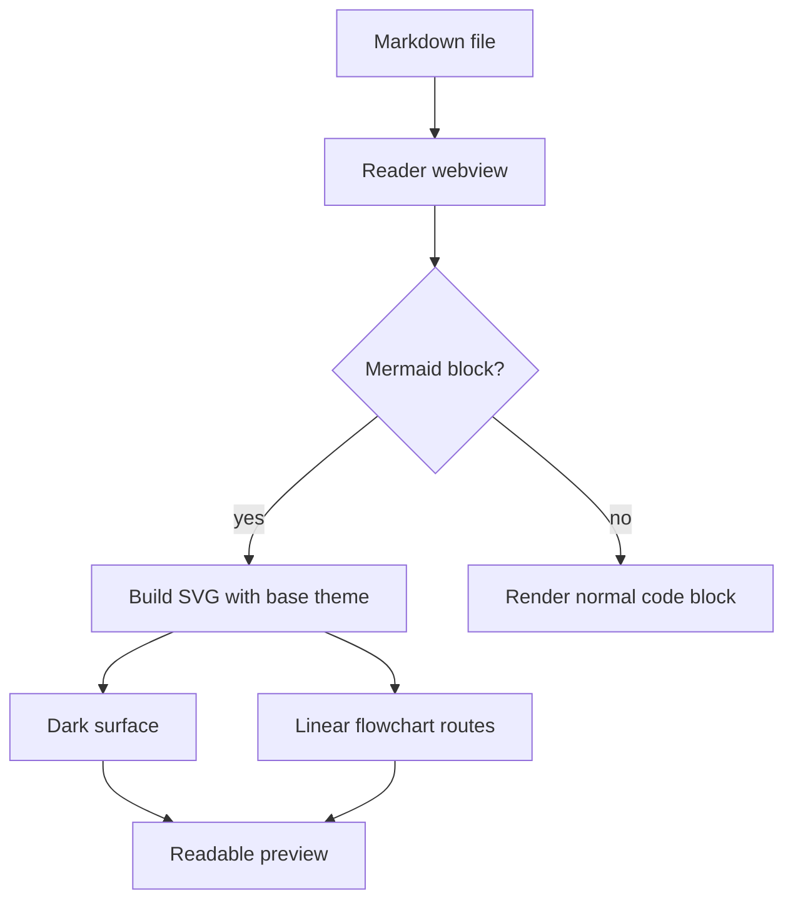
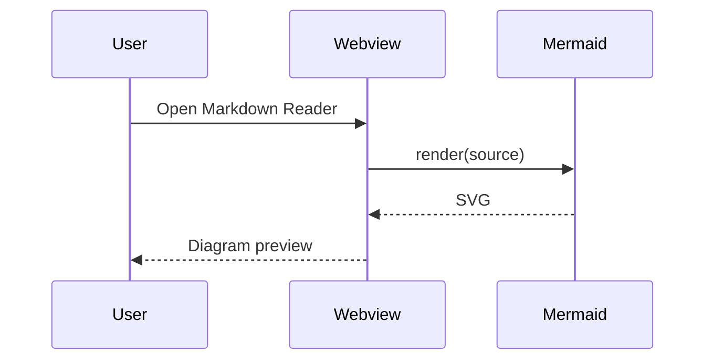
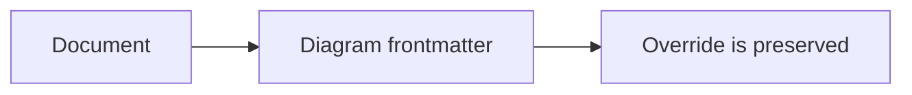

# Mermaid Cursor Style Implementation Plan

> **For agentic workers:** REQUIRED SUB-SKILL: Use superpowers:subagent-driven-development (recommended) or superpowers:executing-plans to implement this plan task-by-task. Steps use checkbox (`- [ ]`) syntax for tracking.

**Goal:** Make Mermaid diagrams in the Markdown Reader render closer to Cursor/VS Code preview: dark restrained surface, muted nodes, cyan readable edges, straight flowchart routing, and preserved fullscreen zoom behavior.

**Architecture:** Keep Mermaid rendering inside the existing Webview pipeline. Replace the one-shot `theme: dark/default` initialization with a small config builder that reads VS Code CSS variables and initializes Mermaid with `theme: "base"` plus stable theme variables and flowchart layout defaults. Keep interaction in the existing `.mermaid-block` wrapper and modal; this plan does not add visual editing or SVG node dragging.

**Tech Stack:** VS Code/Cursor Custom Editor Webview, plain browser JavaScript, Mermaid 11.4.0, CSS variables, Node.js static verification, TypeScript compile via `npm run compile`.

---

## Source Context

- Reference research: `D:\Software\ObsidianSyncVault\快捷指令\Project\markdown-reader\Cursor Mermaid 渲染样式调研.md`
- Supporting vault docs: `D:\Software\ObsidianSyncVault\快捷指令\Project\markdown-reader\why.md`, `D:\Software\ObsidianSyncVault\快捷指令\Project\markdown-reader\MarkdownSideBar.md`, `D:\Software\ObsidianSyncVault\快捷指令\AI\Mermaid 可视化编辑器开源项目调研.md`
- Current rendering path: `media/reportViewer.js:2491-2513` creates `.mermaid-block`, `media/reportViewer.js:2679-2717` initializes Mermaid and renders SVG, `media/report.css:966-1027` styles Mermaid blocks, `media/reportViewer.js:2739-2983` handles fullscreen modal zoom and pan.
- Hard scope boundary: do not run Luban. Do not add a Mermaid visual editor, drag-to-edit graph model, or SVG reverse parser in this change.

## File Structure

- Create: `scripts/verify-mermaid-style.js`
  - No-dependency static regression check for the Mermaid config, CSS shell, and fixture content.
- Create: `docs/fixtures/mermaid-cursor-style-demo.md`
  - Focused manual QA fixture with default flowchart, sequence diagram, and diagram-level config override.
- Modify: `media/reportViewer.js:2679-2717`
  - Add `buildMermaidConfig()`, `initializeMermaidRenderer()`, and `normalizeMermaidSvg()`.
  - Replace the existing one-time `window.__mermaidInitialized` logic.
- Modify: `media/report.css:966-1027`, `media/report.css:1075-1155`
  - Add Cursor-like Mermaid surface variables, wrapper styling, SVG root styling, and modal background alignment.

---

### Task 1: Add Mermaid Style Verification Harness

**Files:**
- Create: `scripts/verify-mermaid-style.js`

- [ ] **Step 1: Write the failing verification script**

Create `scripts/verify-mermaid-style.js` with this exact content:

```js
const fs = require("node:fs");
const path = require("node:path");

const root = path.resolve(__dirname, "..");

function read(relativePath) {
  const filePath = path.join(root, relativePath);
  return fs.readFileSync(filePath, "utf8");
}

function assertContains(file, text) {
  const content = read(file);
  if (!content.includes(text)) {
    throw new Error(`Missing ${file} marker: ${text}`);
  }
}

function assertCount(file, pattern, expected) {
  const content = read(file);
  const matches = content.match(pattern) || [];
  if (matches.length !== expected) {
    throw new Error(`Expected ${expected} matches for ${pattern} in ${file}, found ${matches.length}`);
  }
}

assertContains("media/reportViewer.js", "function buildMermaidConfig()");
assertContains("media/reportViewer.js", 'theme: "base"');
assertContains("media/reportViewer.js", "darkMode: true");
assertContains("media/reportViewer.js", 'curve: "linear"');
assertContains("media/reportViewer.js", 'defaultRenderer: "dagre-wrapper"');
assertContains("media/reportViewer.js", "window.__mermaidConfigKey");
assertContains("media/reportViewer.js", "function normalizeMermaidSvg(wrapper)");
assertContains("media/reportViewer.js", "normalizeMermaidSvg(wrapper);");

assertContains("media/report.css", "--mermaid-edge: #21a7c9;");
assertContains("media/report.css", ".mermaid-svg-root");
assertContains("media/report.css", "max-height: min(70vh, 760px);");
assertContains("media/report.css", "background: var(--mermaid-bg);");

assertContains("docs/fixtures/mermaid-cursor-style-demo.md", "# Mermaid Cursor Style Demo");
assertContains("docs/fixtures/mermaid-cursor-style-demo.md", "flowchart TD");
assertContains("docs/fixtures/mermaid-cursor-style-demo.md", "sequenceDiagram");
assertContains("docs/fixtures/mermaid-cursor-style-demo.md", "curve: stepBefore");
assertCount("docs/fixtures/mermaid-cursor-style-demo.md", /```mermaid/g, 3);

console.log("Mermaid style verification passed.");
```

- [ ] **Step 2: Run the verifier to confirm it fails before implementation**

Run:

```bash
node scripts/verify-mermaid-style.js
```

Expected: FAIL with `Missing media/reportViewer.js marker: function buildMermaidConfig()`.

---

### Task 2: Replace Mermaid Initialization With Cursor-Like Defaults

**Files:**
- Modify: `media/reportViewer.js:2679-2717`
- Test: `scripts/verify-mermaid-style.js`

- [ ] **Step 1: Insert Mermaid config helpers**

In `media/reportViewer.js`, insert this block immediately before `async function hydrateMermaid(root) {`:

```js
function readCssValue(name, fallback) {
  const rootStyle = window.getComputedStyle?.(document.documentElement);
  const value = rootStyle?.getPropertyValue(name)?.trim();
  return value || fallback;
}

function buildMermaidConfig() {
  const editorBackground = readCssValue("--vscode-editor-background", "#1f1f1f");
  const panelBackground = readCssValue("--vscode-sideBar-background", "#252526");
  const textColor = readCssValue("--vscode-editor-foreground", "#d6d6d6");
  const mutedTextColor = readCssValue("--vscode-descriptionForeground", "#9da3a8");
  const borderColor = readCssValue("--vscode-panel-border", "#454545");
  const fontFamily = readCssValue("--vscode-font-family", "Inter, Segoe UI, sans-serif");
  const edgeColor = "#21a7c9";

  return {
    startOnLoad: false,
    securityLevel: "strict",
    theme: "base",
    darkMode: true,
    fontFamily,
    themeVariables: {
      background: editorBackground,
      mainBkg: panelBackground,
      primaryColor: panelBackground,
      primaryTextColor: textColor,
      primaryBorderColor: borderColor,
      secondaryColor: "#303030",
      tertiaryColor: editorBackground,
      tertiaryTextColor: mutedTextColor,
      tertiaryBorderColor: borderColor,
      lineColor: edgeColor,
      defaultLinkColor: edgeColor,
      edgeLabelBackground: editorBackground,
      clusterBkg: editorBackground,
      clusterBorder: borderColor,
      actorBkg: panelBackground,
      actorBorder: borderColor,
      actorTextColor: textColor,
      activationBkgColor: "#303030",
      activationBorderColor: borderColor,
      signalColor: edgeColor,
      signalTextColor: textColor,
      noteBkgColor: panelBackground,
      noteTextColor: textColor,
      fontFamily
    },
    flowchart: {
      curve: "linear",
      defaultRenderer: "dagre-wrapper",
      nodeSpacing: 50,
      rankSpacing: 50,
      htmlLabels: true
    }
  };
}

function initializeMermaidRenderer() {
  const config = buildMermaidConfig();
  const configKey = JSON.stringify(config);
  if (window.__mermaidConfigKey === configKey) {
    return;
  }
  mermaid.initialize(config);
  window.__mermaidConfigKey = configKey;
}

function normalizeMermaidSvg(wrapper) {
  const svg = wrapper.querySelector("svg");
  if (!svg) {
    return;
  }
  svg.setAttribute("role", "img");
  svg.setAttribute("focusable", "false");
  if (!svg.getAttribute("aria-label")) {
    svg.setAttribute("aria-label", "Mermaid diagram");
  }
}
```

- [ ] **Step 2: Replace the old initialization block**

Replace this block inside `hydrateMermaid(root)`:

```js
  if (!window.__mermaidInitialized) {
    mermaid.initialize({
      startOnLoad: false,
      securityLevel: "strict",
      theme: document.body.classList.contains("vscode-dark") ? "dark" : "default",
      fontFamily: "var(--vscode-font-family)"
    });
    window.__mermaidInitialized = true;
  }
```

with:

```js
  initializeMermaidRenderer();
```

- [ ] **Step 3: Normalize rendered SVGs**

In the Mermaid render success path, change:

```js
      wrapper.innerHTML = svg;
      bindFunctions?.(wrapper);
```

to:

```js
      wrapper.innerHTML = svg;
      normalizeMermaidSvg(wrapper);
      bindFunctions?.(wrapper);
```

- [ ] **Step 4: Run verification and confirm remaining failures are CSS/fixture only**

Run:

```bash
node scripts/verify-mermaid-style.js
```

Expected: FAIL with the first remaining missing marker in `media/report.css` or `docs/fixtures/mermaid-cursor-style-demo.md`. It should no longer report missing `buildMermaidConfig`, `curve: "linear"`, or `normalizeMermaidSvg(wrapper);`.

---

### Task 3: Style the Mermaid Wrapper and Fullscreen Modal

**Files:**
- Modify: `media/report.css:1-20`
- Modify: `media/report.css:966-1027`
- Modify: `media/report.css:1075-1155`
- Test: `scripts/verify-mermaid-style.js`

- [ ] **Step 1: Add Mermaid CSS variables**

In the existing `:root` block in `media/report.css`, add these lines after `--blue-soft: color-mix(in srgb, #519aba 14%, transparent);`:

```css
  --mermaid-bg: color-mix(in srgb, var(--vscode-editor-background) 92%, #000 8%);
  --mermaid-surface: color-mix(in srgb, var(--vscode-sideBar-background) 84%, var(--vscode-editor-background) 16%);
  --mermaid-border: color-mix(in srgb, var(--vscode-panel-border) 72%, var(--vscode-editor-foreground) 12%);
  --mermaid-edge: #21a7c9;
```

- [ ] **Step 2: Replace the Mermaid block CSS**

Replace `media/report.css:966-1027` with this block:

```css
.mermaid-block {
  position: relative;
  overflow: auto;
  overscroll-behavior: contain;
  margin: 18px 0;
  padding: 18px;
  max-height: min(70vh, 760px);
  background: var(--mermaid-bg);
  border: 1px solid var(--mermaid-border);
  border-radius: 6px;
}

.mermaid-content {
  display: flex;
  justify-content: center;
  min-height: 56px;
}

.mermaid-svg-root {
  display: inline-flex;
  max-width: 100%;
  min-width: 0;
}

.mermaid-toolbar {
  position: absolute;
  top: 8px;
  right: 8px;
  z-index: 2;
  opacity: 0;
  pointer-events: none;
  transition: opacity 0.15s ease;
}

.mermaid-block.mermaid-rendered:hover .mermaid-toolbar,
.mermaid-block.mermaid-rendered:focus-within .mermaid-toolbar {
  opacity: 1;
  pointer-events: auto;
}

.mermaid-expand-btn {
  display: inline-flex;
  align-items: center;
  justify-content: center;
  width: 28px;
  height: 28px;
  padding: 0;
  border: 1px solid var(--mermaid-border);
  border-radius: 6px;
  background: color-mix(in srgb, var(--mermaid-surface) 88%, transparent);
  color: var(--muted);
  cursor: pointer;
  box-shadow: 0 1px 4px color-mix(in srgb, var(--vscode-widget-shadow, #000) 20%, transparent);
}

.mermaid-expand-btn:hover {
  color: var(--text);
  border-color: var(--line-strong);
  background: var(--mermaid-surface);
}

.mermaid-expand-btn svg {
  width: 14px;
  height: 14px;
}

.mermaid-block svg,
.mermaid-svg-root svg {
  display: block;
  max-width: 100%;
  height: auto;
}
```

- [ ] **Step 3: Align fullscreen modal surface with Mermaid block**

In `media/report.css`, change `.mermaid-modal-panel` from:

```css
.mermaid-modal-panel {
  position: absolute;
  inset: 24px;
  display: flex;
  flex-direction: column;
  border: 1px solid var(--line-strong);
  border-radius: 12px;
  background: var(--paper);
  box-shadow: var(--shadow);
  overflow: hidden;
}
```

to:

```css
.mermaid-modal-panel {
  position: absolute;
  inset: 24px;
  display: flex;
  flex-direction: column;
  border: 1px solid var(--mermaid-border);
  border-radius: 8px;
  background: var(--mermaid-bg);
  box-shadow: var(--shadow);
  overflow: hidden;
}
```

Then change `.mermaid-modal-viewport` from:

```css
.mermaid-modal-viewport {
  flex: 1;
  overflow: auto;
  display: flex;
  align-items: center;
  justify-content: center;
  padding: 48px 24px 24px;
  cursor: default;
  user-select: none;
}
```

to:

```css
.mermaid-modal-viewport {
  flex: 1;
  overflow: auto;
  display: flex;
  align-items: center;
  justify-content: center;
  padding: 48px 24px 24px;
  background: var(--mermaid-bg);
  cursor: default;
  user-select: none;
}
```

- [ ] **Step 4: Run verification and confirm remaining failure is fixture only**

Run:

```bash
node scripts/verify-mermaid-style.js
```

Expected: FAIL with `Missing docs/fixtures/mermaid-cursor-style-demo.md marker: # Mermaid Cursor Style Demo`.

---

### Task 4: Add Focused Mermaid QA Fixture

**Files:**
- Create: `docs/fixtures/mermaid-cursor-style-demo.md`
- Test: `scripts/verify-mermaid-style.js`
- Test: `npm run compile`

- [ ] **Step 1: Create the fixture**

Create `docs/fixtures/mermaid-cursor-style-demo.md` with this exact content:

````markdown
# Mermaid Cursor Style Demo

This fixture verifies the Markdown Reader Mermaid baseline:

- Default flowcharts use the reader-level Mermaid config.
- Flowchart edges should read as straight or angular routes, not soft decorative curves.
- Nodes should sit on a restrained dark surface with muted borders.
- Cyan edges and arrowheads should remain easy to follow in Cursor dark themes.
- Fullscreen preview should keep the same visual tone while preserving zoom and drag.

## Default Flowchart



## Sequence Diagram



## Diagram-Level Curve Override


````

- [ ] **Step 2: Run the Mermaid style verifier**

Run:

```bash
node scripts/verify-mermaid-style.js
```

Expected: PASS with `Mermaid style verification passed.`

- [ ] **Step 3: Compile the extension**

Run:

```bash
npm run compile
```

Expected: PASS. The command should finish `tsc -p ./` and copy `node_modules/mermaid/dist/mermaid.min.js` to `media/mermaid.min.js`.

- [ ] **Step 4: Commit the implementation**

Run:

```bash
git add media/reportViewer.js media/report.css docs/fixtures/mermaid-cursor-style-demo.md scripts/verify-mermaid-style.js
git commit -m "feat: tune mermaid preview style"
```

Expected: commit succeeds with only the four listed files staged.

---

### Task 5: Manual Cursor/Webview QA

**Files:**
- Verify: `docs/fixtures/mermaid-cursor-style-demo.md`
- Verify: `docs/fixtures/full-feature-demo.md`

- [ ] **Step 1: Launch Extension Development Host**

Run:

```bash
npm run compile
```

Expected: PASS. Then press F5 in Cursor or VS Code with this repository open and select the existing Run Extension launch configuration.

- [ ] **Step 2: Open the focused fixture**

In the Extension Development Host, open:

```text
docs/fixtures/mermaid-cursor-style-demo.md
```

Use `Open with Meow Report Markdown Viewer`.

Expected:

- The default flowchart renders in a dark Mermaid surface.
- Flowchart connectors are straight/angular rather than soft Bezier curves.
- Node fill and borders are muted, not bright Mermaid defaults.
- Directional edges and arrowheads are cyan and easy to trace.
- The sequence diagram is readable against the same surface.
- The third diagram still honors `curve: stepBefore` from diagram frontmatter.

- [ ] **Step 3: Verify fullscreen interaction still works**

Click the Mermaid fullscreen button on the default flowchart.

Expected:

- The modal opens with the same dark surface.
- Wheel zoom changes scale.
- Drag works after zooming in above `1.001`.
- Reset returns scale and offset to the original state.
- Escape closes the modal.

- [ ] **Step 4: Regression check the existing full-feature fixture**

Open:

```text
docs/fixtures/full-feature-demo.md
```

Expected:

- Existing Mermaid fullscreen controls still appear on hover.
- Cite navigation and return buttons still work.
- Table, code block, link, and TOC behavior are unchanged.

---

## Self-Review

- Spec coverage: The plan maps the research recommendation to `theme: "base"`, dark `themeVariables`, `flowchart.curve: "linear"`, wrapper CSS, and preserved fullscreen zoom. It intentionally leaves visual editing out because the reference docs describe that as a later product layer.
- Placeholder scan: Clear. Every file change has concrete content, exact paths, and verification commands.
- Type consistency: Helper names are consistent across the verifier and implementation steps: `buildMermaidConfig`, `initializeMermaidRenderer`, `normalizeMermaidSvg`, and `window.__mermaidConfigKey`.
